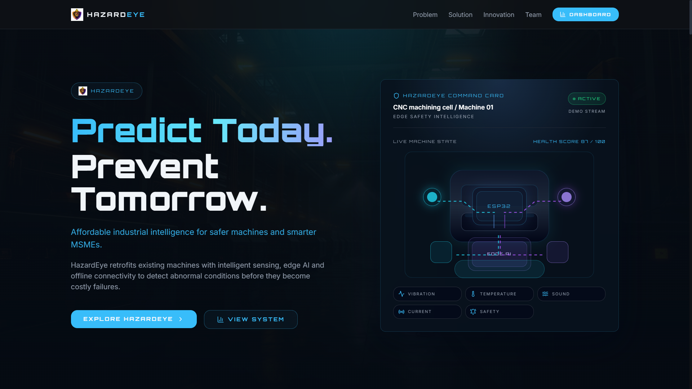
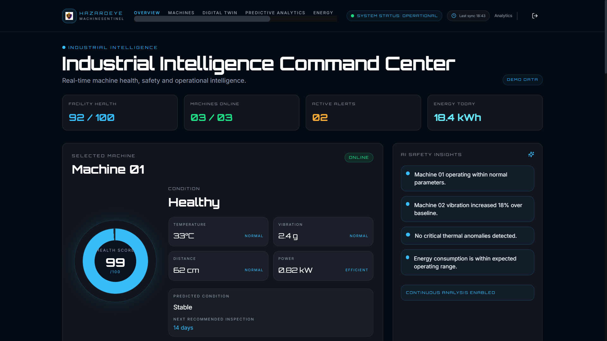
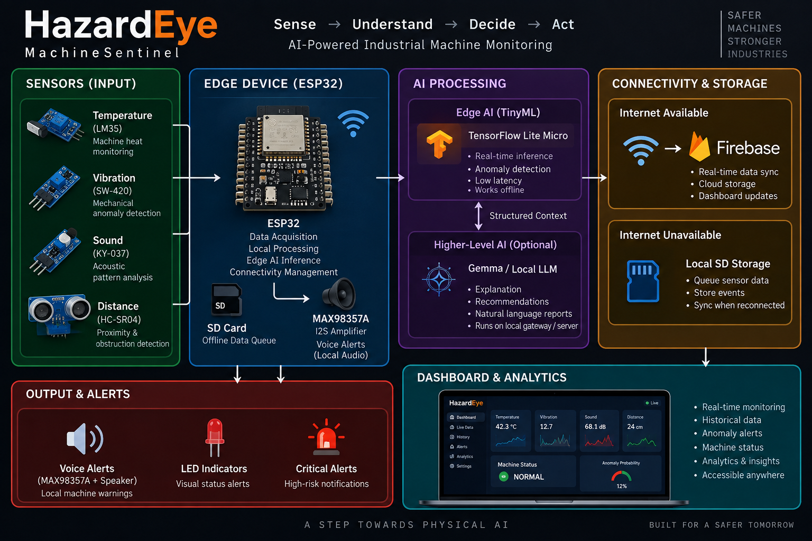
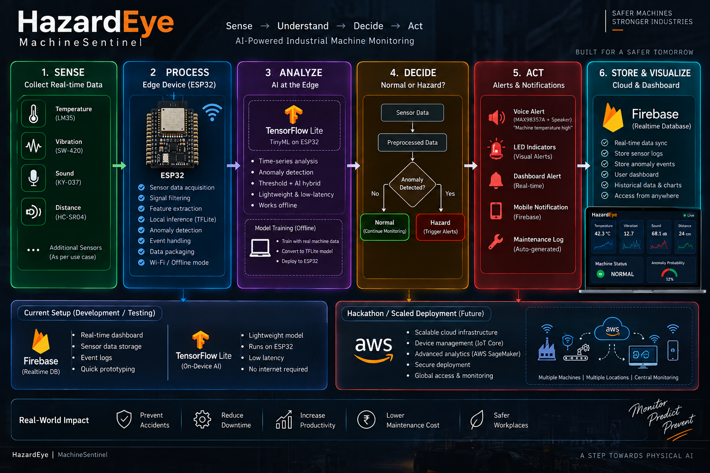
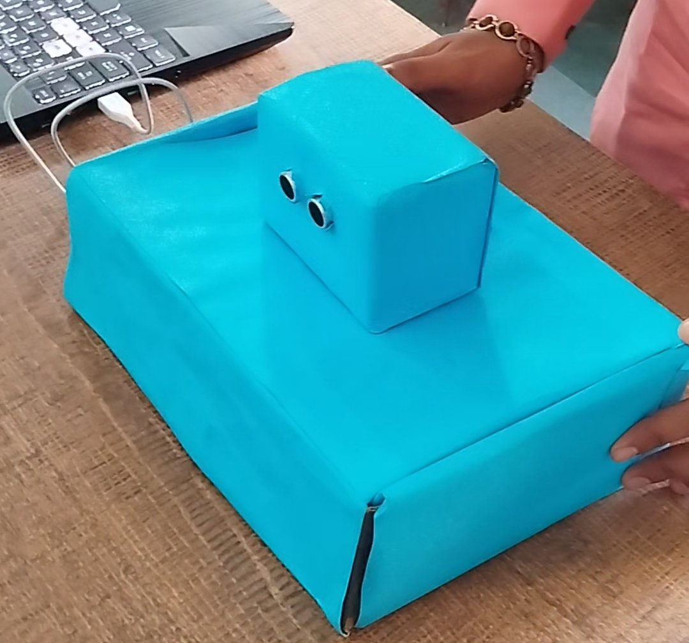
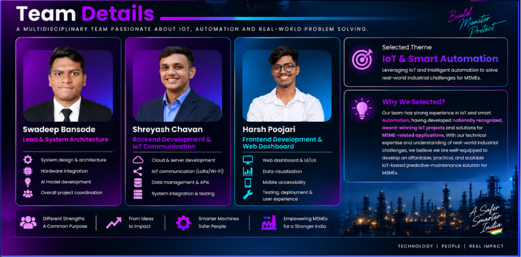

# MUSA CODEX2026 SYGNIX-CX0901
# ⚡ HazardEye

### Industrial Intelligence for the Physical World

> **Sense. Understand. Predict. Respond.**

HazardEye is an **AI-powered Industrial IoT platform** designed to monitor machines, detect abnormal conditions, improve workplace safety, and turn industrial telemetry into actionable intelligence.

Built by **Team SYGNIX** for **MUSA CODEX 2026 — CX0901**.

---

## 🚀 Live Dashboard

### Current Dashboard
🔗 **[Open HazardEye Dashboard](https://machinesentinel.vercel.app/)**

### Previous / Prototype Dashboard
🔗 **[Open Previous Dashboard](https://hazardeye-mu.vercel.app)**

---

## 🖼️ Product Preview

### Homepage



### Live Dashboard



### System Architecture



### End-to-End Workflow



### Hardware MVP



---

## 🚨 The Problem

Industrial environments continuously generate physical data:

- Machine temperature
- Vibration
- Sound
- Distance / proximity
- Machine operating conditions
- Environmental parameters

However, this data is often fragmented across sensors, machines, manual inspections and disconnected systems.

HazardEye aims to bridge the gap between the **physical machine and actionable intelligence**.

---

## 💡 Our Approach
```
PHYSICAL WORLD
      ↓
SENSORS / IoT NODES
      ↓
EDGE DEVICE
      ↓
TELEMETRY + LOCAL PROCESSING
      ↓
AI / ANOMALY DETECTION
      ↓
INSIGHTS + ALERTS
      ↓
DASHBOARD
      ↓
HUMAN ACTION
```
The goal is not simply to collect sensor readings.

Turn physical data into context, intelligence and action.
---
🏗️ System Architecture

HazardEye follows a modular physical-to-digital architecture:
```
┌─────────────────────────────────────────────┐
│              PHYSICAL LAYER                │
│ Sensors • Machines • Industrial Equipment  │
└──────────────────────┬──────────────────────┘
                       ↓
┌─────────────────────────────────────────────┐
│                 IoT LAYER                  │
│ ESP32 • Sensor Nodes • Telemetry           │
└──────────────────────┬──────────────────────┘
                       ↓
┌─────────────────────────────────────────────┐
│                EDGE LAYER                  │
│ Local Processing • Buffering • Alerts      │
└──────────────────────┬──────────────────────┘
                       ↓
┌─────────────────────────────────────────────┐
│                 AI LAYER                   │
│ TinyML • Anomaly Detection • Analytics     │
└──────────────────────┬──────────────────────┘
                       ↓
┌─────────────────────────────────────────────┐
│             CONNECTIVITY LAYER             │
│ Wi-Fi / IoT Connectivity / Offline Sync   │
└──────────────────────┬──────────────────────┘
                       ↓
┌─────────────────────────────────────────────┐
│              SOFTWARE LAYER                │
│ Dashboard • Analytics • Alerts • History  │
└─────────────────────────────────────────────┘
```
---
🤖 AI + Edge Intelligence

The current prototype explores TensorFlow Lite Micro / TinyML for edge-level intelligence.

The AI layer is designed for:

Real-time anomaly detection
Local inference
Low-latency decisions
Offline operation
Machine behaviour analysis

Higher-level AI can later be integrated for contextual explanations, recommendations and natural-language industrial reports.
---
📡 IoT & Offline-First Design

Industrial connectivity cannot always be assumed to be reliable.

HazardEye therefore follows an offline-first architecture:

```
Sensors
   ↓
Edge Device
   ↓
Local Processing
   ↓
Local Storage / Queue
   ↓
Connectivity Available?
   ├── YES → Cloud Sync → Dashboard
   └── NO  → Continue Locally
```
This allows critical sensing and alert workflows to continue even when internet connectivity is unavailable.
---
⚠️ Alerts & Safety

HazardEye is designed to support both machine intelligence and worker safety.

Potential alert categories include:

Machine anomalies
Unsafe operating conditions
Threshold violations
Sensor abnormalities
Equipment health warnings
Predictive maintenance events
Worker safety alerts

The system can provide local voice alerts, visual indicators and dashboard notifications.
---
🖥️ Dashboard

The dashboard acts as the operational interface between the physical infrastructure and the human operator.

It brings together:
```
Machines
   +
Live Telemetry
   +
Analytics
   +
Alerts
   +
Machine Status
   +
Historical Data
```
This provides a single environment for monitoring industrial assets and understanding machine behaviour.
---

🔧 Hardware Prototype

The prototype architecture is based around ESP32-class edge devices and industrial sensing concepts.

Example sensing layer:

Temperature
Vibration
Sound
Distance / proximity
Machine-state signals

The prototype also explores local audio alerts using an I2S audio amplifier + speaker and local storage for offline data handling.

🧠 Development Direction
Hackathon Prototype

For the hackathon demonstration, HazardEye can be demonstrated using an ESP32-based prototype, sensor nodes, the AI layer and the software dashboard.

The focus is on demonstrating the complete:

Sense → Understand → Decide → Act

loop within the available development window.

Industrial Deployment

For real industrial deployment, the architecture can evolve towards:

Industrial-grade controllers
Robust sensor nodes
Industrial communication protocols
AWS IoT infrastructure
Secure device management
Scalable cloud analytics
Production-grade AI/ML pipelines

This allows the prototype architecture to evolve without replacing the overall product concept.

🛠️ Technology Stack
Software
React
TypeScript
Vite
Modular frontend architecture
Real-time monitoring
Data visualization
IoT / Hardware
ESP32-class edge devices
Industrial sensors
IoT sensor nodes
Edge processing
Wireless connectivity
AI / ML
TensorFlow Lite Micro / TinyML
Anomaly detection
Predictive analytics
AI-assisted decision support
Current Prototype Backend
Firebase
Hackathon / Production Direction
AWS IoT
Cloud telemetry
Scalable device connectivity
Industrial-grade deployment architecture
```
📂 Repository Structure
.
├── hardware/
│   └── Hardware and edge-AI related resources
│
├── software/
│   └── HazardEye software platform
│
├── docs/
│   ├── homepage.png
│   ├── dashboard.png
│   ├── architecture.png
│   ├── workflow.png
│   └── MVP-hardware.jpg
│
└── README.md
```
---
🔄 Product Evolution

HazardEye is being developed around a larger progression:
```
Monitoring
     ↓
Detection
     ↓
Understanding
     ↓
Prediction
     ↓
Intelligent Response

The long-term objective is to build systems that can continuously sense physical environments, understand their state and assist humans in making better operational and safety decisions.
```
---
🌐 Physical AI

HazardEye explores the intersection of:

AI × IoT × Hardware × Software × Physical Systems

Instead of intelligence existing only inside software, HazardEye brings intelligence closer to the physical world — machines, sensors, infrastructure and people.

----
🏆 About the Project

HazardEye originated as a college innovation project focused on industrial safety and machine monitoring.

The project evolved into a broader exploration of AI-powered Industrial IoT and Physical AI, and now contributes to the product-building direction of SYGNIX.


---
👨‍💻 Team SYGNIX



Swadeep Bansode — Lead & System Architecture

Shreyash Chavan — Backend Development & IoT Communication

Harsh Poojari — Frontend Development & Web Dashboard

---
🎯 Vision

Don't just collect industrial data. Make the physical world understandable.

HazardEye — Safer Machines. Stronger Industries.
